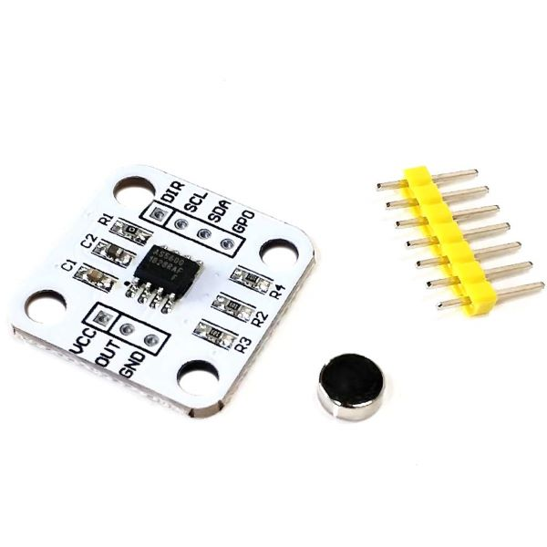

# AS5600
An Arduino library to handle the breakout board for the AS5600S magnetic
absolute encoder via I2C.

## Usage
- Download the code as a .ZIP file.
- In the Arduino IDE, navigate to *Sketch/Include Library/Add .ZIP Library*.
- At the top of the drop down list, select the option to *Add .ZIP Library*.
- Usage examples will appear in *File/Examples/AS5600*.
